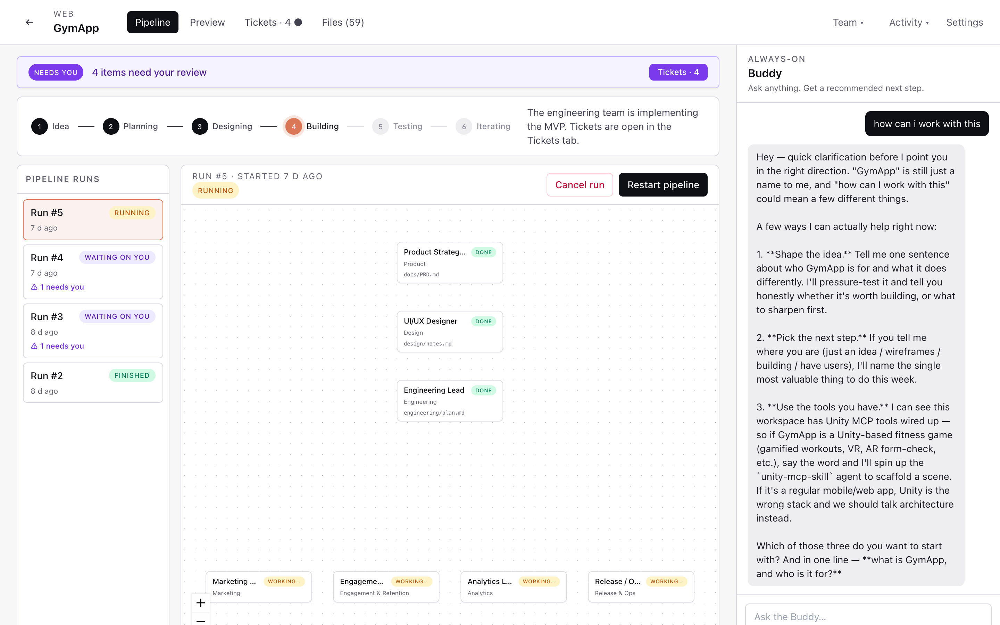
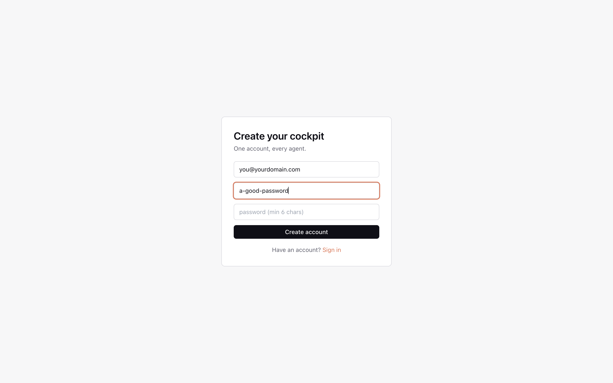
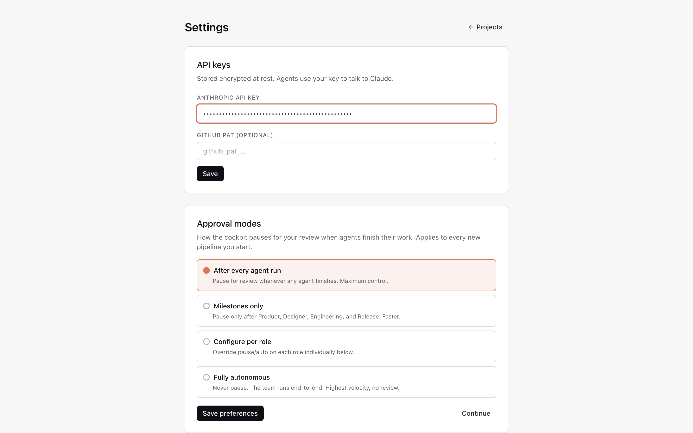
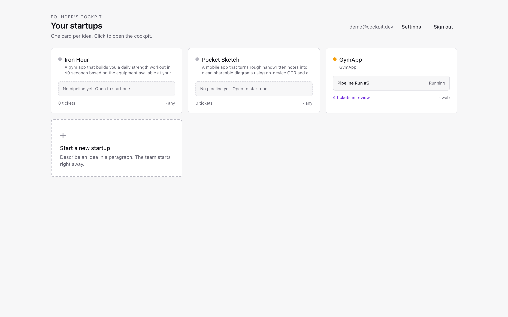
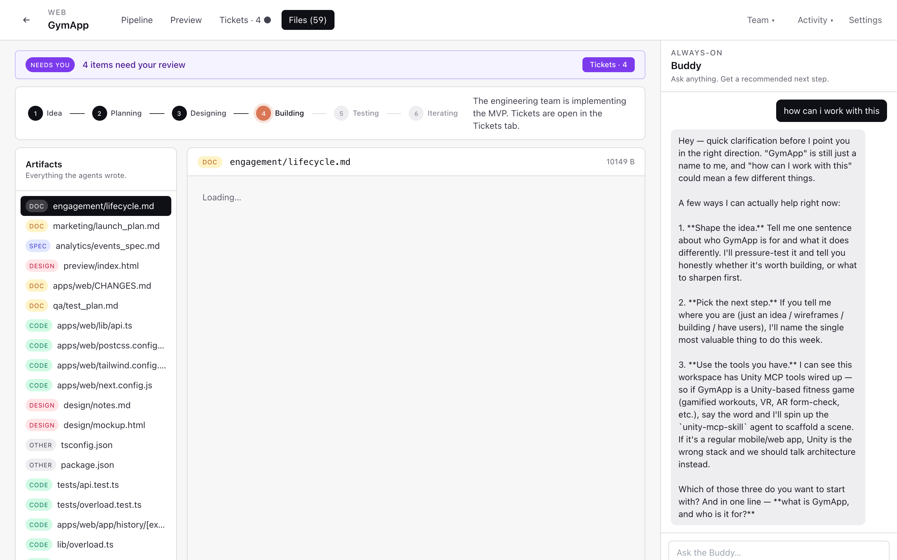
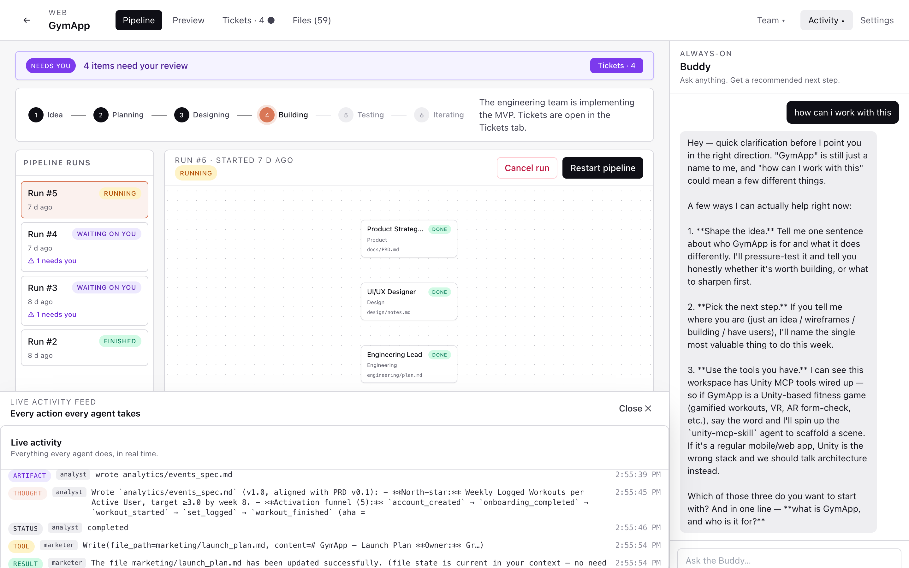

# Founder's Cockpit

[](LICENSE)
[](https://www.python.org/)
[](https://nodejs.org/)
[](https://www.anthropic.com/)
[](https://miladnalbandi.github.io/founders-cockpit/)

A Claude Desktop–style application for solo founders. Spin up a startup project, and an organization of AI agents — CEO, Product Strategist, Designer, Engineer, Marketing, Engagement, Analytics, Release, plus an always-on Buddy advisor — gets to work. Watch each agent's activity live, browse the artifacts they wrote into your project workspace, and chat with the Buddy any time.



> 📖 **[Full step-by-step tutorial with screenshots →](https://miladnalbandi.github.io/founders-cockpit/tutorial.html)**

```
┌──────────────────────────────────────────────────────────┐
│  Electron + React desktop client                         │
│  WorkflowBoard · OrgChart · ActivityFeed · BuddyPanel    │
└──────────────────────────────────────────────────────────┘
              REST + WebSocket (Channels)
                          │
┌─────────────────────────┴────────────────────────────────┐
│  Django backend (multi-tenant SaaS)                      │
│  DRF · Channels · Celery · Postgres/SQLite · Redis       │
│  Anthropic SDK with tool use                             │
│  Per-user/per-project filesystem workspace               │
└──────────────────────────────────────────────────────────┘
```

## What the agents do

| Role | Implementation | What it produces |
|---|---|---|
| CEO / Orchestrator | full | Routes the next action across the org |
| Product Strategist | full | `docs/PRD.md` — concrete PRD with MVP scope & day-by-day plan |
| UI/UX Designer | full | `design/mockup.html` — Tailwind mockup of 3 screens |
| Full-Stack Engineer | full | `apps/web`, `apps/api`, `apps/mobile` scaffolds + root README |
| Marketing Lead | stub | `marketing/plan.md` placeholder |
| Engagement Lead | stub | `engagement/plan.md` placeholder |
| Analytics Lead | stub | `analytics/plan.md` placeholder |
| Release / Ops Lead | stub | `release/plan.md` placeholder |
| Buddy Advisor | full | Always-on streaming chat; recommends next steps |

Each agent has a tool allowlist (filesystem read/write, listing, shell exec, git) executed safely inside the project's sandboxed workspace at `backend/workspaces/{user_id}/{project_id}/`.

## Running locally (fastest path)

Two terminals.

### 1. Backend

```bash
cd backend
uv venv --python 3.12 .venv
source .venv/bin/activate
uv pip install django djangorestframework djangorestframework-simplejwt django-cors-headers 'channels[daphne]' channels-redis celery redis 'psycopg[binary]' anthropic cryptography python-dotenv pydantic
cp .env.example .env             # optional — uses sane defaults
python manage.py migrate
CHANNELS_IN_MEMORY=1 CELERY_EAGER=1 python manage.py runserver 8000
```

Why those env flags? `CHANNELS_IN_MEMORY=1` skips Redis for WebSocket pub/sub, and `CELERY_EAGER=1` runs agent tasks inline instead of via a separate worker. Drop both once you've added Postgres + Redis via docker-compose.

### 2. Frontend

```bash
cd desktop
npm install
npm run dev   # starts Vite on :5173 and Electron once it's up
```

When the Electron window opens:
1. Register → enter your email + password.
2. On Settings, paste your **Anthropic API key** (and optionally a GitHub PAT).
3. Back to Projects → create a startup with a name and a one-paragraph idea.
4. You'll land in the **Cockpit**:
   - **Workflow** tab — kanban of all departments, click *Run* on any card.
   - **Org chart** tab — live status pulses on every agent, click any to dispatch.
   - **Activity feed** tab — streaming log of thoughts, tool calls, artifacts.
   - **Artifacts** tab — preview the files agents wrote (HTML mockups render in an iframe).
   - **Buddy** (right rail, always visible) — chat with your advisor; replies stream token by token.

### Upgrading from the smoke-test setup

When you're ready for the real stack:

```bash
docker compose -f docker-compose.dev.yml up -d     # Postgres + Redis
cd backend
export POSTGRES_DB=cockpit POSTGRES_USER=cockpit POSTGRES_PASSWORD=cockpit POSTGRES_HOST=127.0.0.1
python manage.py migrate

# Terminal A — ASGI server (HTTP + WebSocket)
python -m daphne -b 0.0.0.0 -p 8000 cockpit.asgi:application

# Terminal B — Celery worker (runs the agent + buddy tasks)
celery -A cockpit worker -l info
```

## Screenshot tour

| | |
|---|---|
|  |  |
| **1. Register** — local account, no email verification | **2. Settings** — paste your Anthropic key (encrypted at rest) |
|  |  |
| **3. Your startups** — one card per idea | **4. Pipeline** — Idea → Planning → Designing → Building → Testing → Iterating |
|  |  |
| **5. Files** — every artifact the org wrote: PRD, mockup, code, plans | **6. Activity feed** — every action every agent takes |

Full walkthrough on the [**tutorial page**](https://miladnalbandi.github.io/founders-cockpit/tutorial.html).

## Project layout

```
backend/
  cockpit/                  Django project (settings, asgi, celery)
  apps/
    accounts/               User + encrypted Anthropic key
    projects/               Project model + signal to bootstrap agents
    agents/                 ★ runtime.py, tools.py, registry.py, roles
    tasks/                  Workflow kanban
    artifacts/              Files agents wrote
    chat/                   Buddy threads + Channels consumer
desktop/
  electron/                 Electron main + preload
  src/
    api/                    HTTP client + WebSocket
    store/                  zustand stores
    views/Cockpit/          OrgChart, ActivityFeed, BuddyPanel, WorkflowBoard, ArtifactsPanel
```

## Security notes

- Anthropic keys are encrypted at rest with Fernet (`apps/accounts/crypto.py`); set a real `FERNET_KEY` in production.
- All filesystem tools resolve paths against the project workspace and reject any traversal.
- `shell_exec` has a tight allowlist (`python`, `pip`, `uv`, `npm`, `node`, `git`, …); even within that, every command runs in the project workspace with a 60s timeout.
- Agent runs have hard caps: max iterations, max tokens per turn, total timeout (see `cockpit/settings.py`).

## What v1 deliberately leaves out

- Real App Store Connect / Play Console publishing — the Release agent is a stub.
- Real ad-platform integrations — the Marketing agent is a stub.
- Real push-notification delivery — the Engagement agent is a stub.
- Per-tenant Stripe billing for the SaaS itself.
- Raster image generation for designs — v1 produces HTML/CSS mockups.

These are the Phase-2 stories the cockpit itself will eventually help you build.

## Contributing

PRs welcome — see [CONTRIBUTING.md](CONTRIBUTING.md). Issues: [GitHub Issues](https://github.com/MiladNalbandi/founders-cockpit/issues).

## License

[GPL-3.0](LICENSE) © Founder's Cockpit contributors. Free to use, modify, and distribute — derivative works must remain GPL-3.0.
