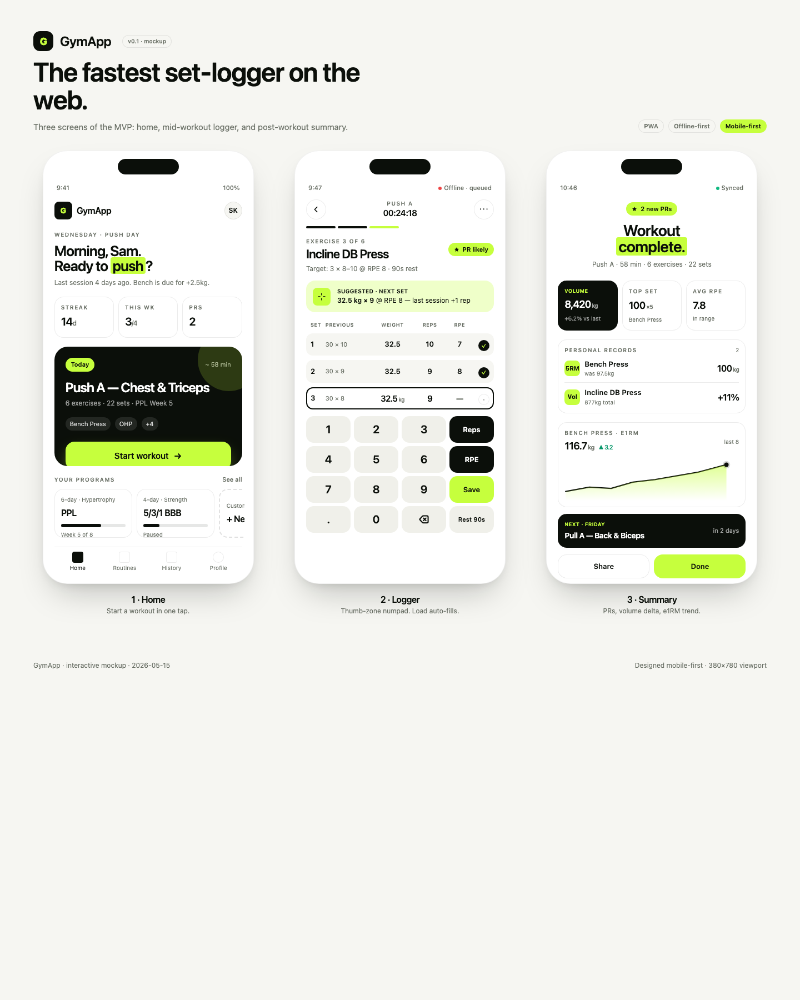
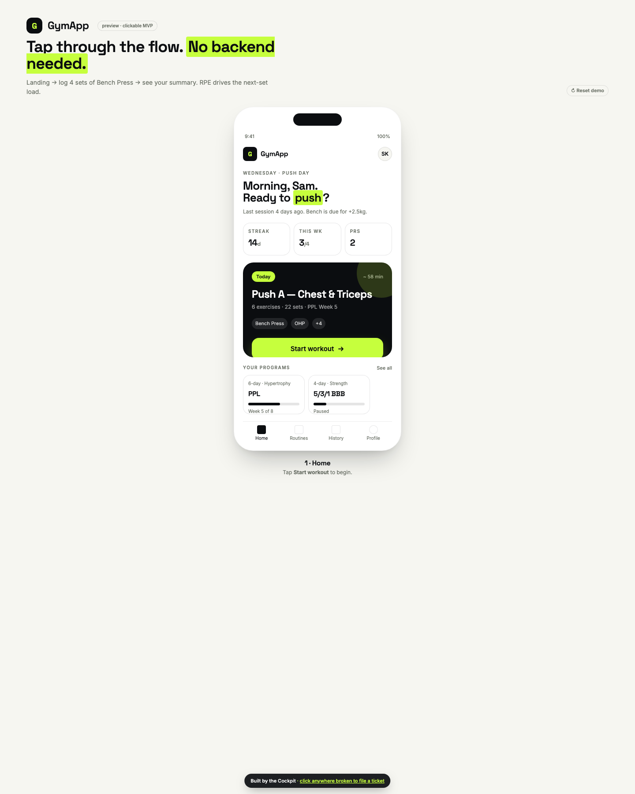

# Example: GymApp

A complete artifact set written by a Founder's Cockpit organization on a single one-paragraph idea:

> **GymApp** — the fastest set-logger on the web. Daily strength workout built in 60 seconds from the equipment available at your gym today; tracks sets and PRs hands-free with voice; adapts the next session to how the last one actually felt.

Every file linked below was produced by a Claude agent inside the cockpit — no human edits.

## Design — UI/UX Designer agent

[](design/mockup.html)

- 🎨 **[Interactive mockup (3 screens)](design/mockup.html)** — Home, Set Logger, Workout Summary
- 📝 **[Designer notes](design/notes.md)** — type, color, motion rationale

## Engineering preview — Frontend + Backend + QA agents

[](preview/index.html)

- 🖱️ **[Clickable MVP](preview/index.html)** — log 4 sets of Bench Press → see your summary; RPE drives the next-set load
- 📄 **[Product Requirements Document](PRD.md)** — Product Strategist's MVP scope + day-by-day plan

## What the rest of the org produced

In the live cockpit's **Files** tab (see the [tutorial](../../tutorial.html)) you can browse the rest of the workspace:

```
backend/workspaces/{user_id}/{project_id}/
├── docs/PRD.md                       # Product Strategist
├── design/mockup.html · notes.md     # Designer
├── preview/index.html                # Frontend Engineer
├── apps/web/                         # Next.js scaffold
├── apps/api/                         # API scaffold
├── apps/mobile/                      # React Native scaffold
├── lib/overload.ts                   # Backend Engineer — progressive overload
├── tests/{api,overload}.test.ts      # QA Engineer
├── qa/test_plan.md                   # QA Engineer
├── marketing/launch_plan.md · plan.md  # Marketing Lead
├── engagement/lifecycle.md · plan.md   # Engagement Lead
├── analytics/events_spec.md · plan.md  # Analytics Lead
├── release/launch_checklist.md · plan.md  # Release Lead
└── engineering/tickets.json · plan.md     # Engineering Lead
```

---

[← Back to overview](../../)
