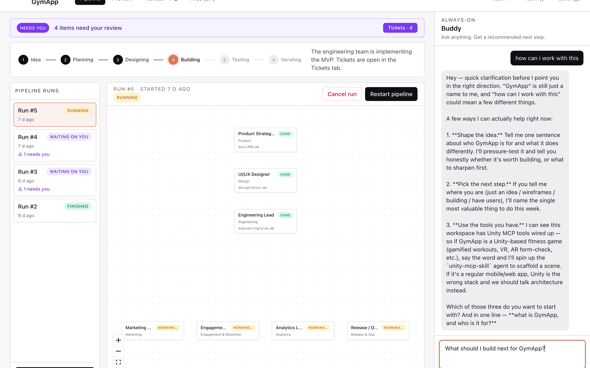

# Founder's Cockpit

A Claude Desktop–style application for solo founders. Spin up a startup project, and an **organization of AI agents** — CEO, Product Strategist, Designer, Engineer, Marketing, Engagement, Analytics, Release, plus an always-on Buddy advisor — gets to work in your project workspace.


## Why

You're one person with an idea. You don't have a PM, a designer, a frontend engineer, a backend engineer, a QA, and a growth lead. The Cockpit gives you each of those as a Claude-powered agent — every one of them writing real files into a sandboxed workspace you can inspect, edit, and ship.

## Quick links

- 📖 [**Full tutorial**](tutorial.html) — step-by-step from `git clone` to your first pipeline
- 🧑‍💻 [Source on GitHub](https://github.com/MiladNalbandi/founders-cockpit)
- 🐛 [Issues](https://github.com/MiladNalbandi/founders-cockpit/issues)
- 📜 [GPL-3.0 License](https://github.com/MiladNalbandi/founders-cockpit/blob/main/LICENSE)

## What's inside

```
┌──────────────────────────────────────────────────────────┐
│  Electron + React desktop client                         │
│  Pipeline · Preview · Tickets · Files · Buddy            │
└──────────────────────────────────────────────────────────┘
              REST + WebSocket (Channels)
                          │
┌─────────────────────────┴────────────────────────────────┐
│  Django backend (multi-tenant SaaS)                      │
│  DRF · Channels · Celery · Postgres/SQLite · Redis       │
│  Anthropic SDK with tool use                             │
│  Per-user/per-project filesystem workspace               │
└──────────────────────────────────────────────────────────┘
```

## The agents

| Role | What it produces |
|---|---|
| **CEO / Orchestrator** | Routes the next action across the org |
| **Product Strategist** | `docs/PRD.md` — concrete PRD with MVP scope & day-by-day plan |
| **UI/UX Designer** | `design/mockup.html` — Tailwind mockup of 3 screens |
| **Frontend Engineer** | `apps/web/` + the live `preview/index.html` |
| **Backend Engineer** | `apps/api/` scaffolds |
| **QA Engineer** | runs the pipeline against the preview, files tickets |
| **Buddy Advisor** | Always-on streaming chat; recommends next steps |

Plus Marketing, Engagement, Analytics, and Release leads ready to be filled in. Each agent has a tool allowlist (filesystem read/write, listing, shell exec, git) executed **safely inside the project's sandboxed workspace** at `backend/workspaces/{user_id}/{project_id}/`.

## Screenshot tour

| | |
|---|---|
|  |  |
| **Pipeline** — Idea → Planning → Designing → Building → Testing → Iterating | **Files** — every artifact the org wrote: PRD, mockup, code, plans |
|  |  |
| **Activity feed** — every action every agent takes | **Buddy** — your always-on advisor, streams token-by-token |

Full walkthrough → [**tutorial**](tutorial.html).

## License

GPL-3.0. See [LICENSE](https://github.com/MiladNalbandi/founders-cockpit/blob/main/LICENSE).
