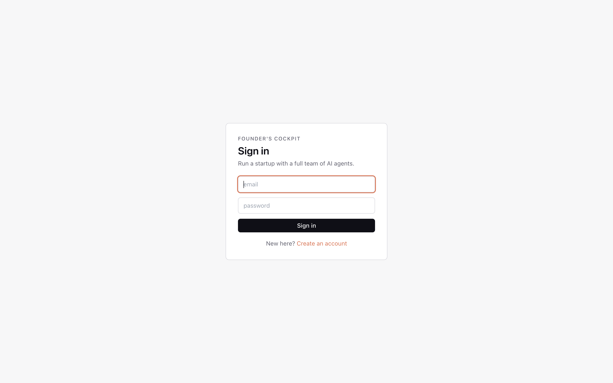
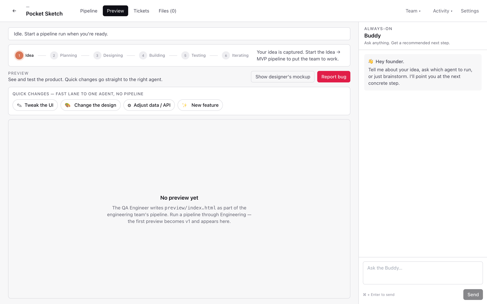

# Tutorial: from clone to your first pipeline

This walkthrough takes you from a fresh `git clone` to watching a real Claude pipeline write code into your project workspace. ~10 minutes.

> **You'll need:** Python 3.12, Node 18+, and an [Anthropic API key](https://console.anthropic.com/).

---

## 1. Clone & install

```bash
git clone https://github.com/MiladNalbandi/founders-cockpit.git
cd founders-cockpit
```

The repo has two halves: `backend/` (Django + Channels + Celery) and `desktop/` (Electron + React + Vite).

---

## 2. Start the backend

Open a terminal:

```bash
cd backend
uv venv --python 3.12 .venv
source .venv/bin/activate
uv pip install django djangorestframework djangorestframework-simplejwt \
  django-cors-headers 'channels[daphne]' channels-redis celery redis \
  'psycopg[binary]' anthropic cryptography python-dotenv pydantic
python manage.py migrate
CHANNELS_IN_MEMORY=1 CELERY_EAGER=1 python manage.py runserver 8000
```

`CHANNELS_IN_MEMORY=1` skips Redis for WebSocket pub/sub. `CELERY_EAGER=1` runs agent tasks inline. Drop both once you've moved to docker-compose for Postgres + Redis.

---

## 3. Start the desktop app

Open a second terminal:

```bash
cd desktop
npm install
npm run dev
```

Vite comes up on `:5183` and Electron launches once it's ready.

---

## 4. Create your account


Pick any email + password. There's no email verification in v1 — accounts live in SQLite locally.

Already have one? Sign in instead:



---

## 5. Paste your Anthropic key


In **Settings**, paste your `sk-ant-...` key. It's encrypted at rest with Fernet (see `apps/accounts/crypto.py`) — never sent anywhere except api.anthropic.com.

While you're here, pick an **approval mode**:
- **After every agent run** — pause for review whenever any agent finishes. Maximum control.
- **Milestones only** — pause only after Product, Designer, Engineering, and Release.
- **Configure per role** — override pause/auto on each role individually.
- **Fully autonomous** — never pause. Highest velocity, no review.

Optional: paste a GitHub PAT to let the Engineer push scaffolds.

---

## 6. Start your first startup


Click **+** on "Start a new startup", give it a name and a one-paragraph idea. The signal handler in `apps/projects/` bootstraps a full agent organization for the project.

---

## 7. The cockpit — Pipeline tab

You land on the **Pipeline** view — the linear flow your team will run through.


Stages: **Idea → Planning → Designing → Building → Testing → Iterating**. Click **Run Idea → MVP pipeline** to kick everyone off. The Product Strategist picks up first and writes `docs/PRD.md` into your sandboxed workspace.

The **Buddy** in the right rail is always there. Ask it what to do next or just brainstorm — replies stream token by token.

---

## 8. Preview tab — see the product as it's built



The **Preview** tab is where the engineering team's output lands — a live `preview/index.html` rendered in the cockpit itself. Use the quick-change chips to nudge the team without a full pipeline run:

- 🎨 **Tweak the UI** — straight to the designer
- 🏷️ **Change the design** — design + frontend
- ⚙️ **Adjust data / API** — backend
- ✨ **New feature** — full team

When something's wrong, click **Report bug** and a ticket is filed against the right agent.

---

## 9. Activity feed — watch the org work

Open **Activity** (top right) to see every thought, tool call, and artifact streaming live:


This is the same stream that drives the pipeline progress dots — useful for debugging agent runs or just enjoying the show.

---

## 10. Chat with Buddy


The right rail is always on. Buddy reads your project state and recommends the next concrete step. Ask things like:

- _"What should I do first?"_
- _"Why did the Designer pick a vertical layout?"_
- _"Summarize the PRD for me."_

---

## 11. Where do my files live?

```
backend/workspaces/{user_id}/{project_id}/
├── docs/PRD.md
├── design/mockup.html
├── preview/index.html
└── apps/{web,api,mobile}/
```

Real files on your disk, sandboxed per project. You can `cd` in and run them, commit them, ship them.

---

## Upgrading from smoke-test to real stack

```bash
docker compose -f docker-compose.dev.yml up -d   # Postgres + Redis
cd backend
export POSTGRES_DB=cockpit POSTGRES_USER=cockpit POSTGRES_PASSWORD=cockpit POSTGRES_HOST=127.0.0.1
python manage.py migrate

# Terminal A — ASGI server (HTTP + WebSocket)
python -m daphne -b 0.0.0.0 -p 8000 cockpit.asgi:application

# Terminal B — Celery worker (runs agent + buddy tasks)
celery -A cockpit worker -l info
```

---

## Troubleshooting

| Symptom | Fix |
|---|---|
| Electron window doesn't open | Make sure Vite is up on `:5183` first; check `desktop/electron/main.ts` logs |
| `401` on every API call | You're not logged in — Sign in again, then refresh |
| Pipeline hangs at "Planning" | Anthropic key missing or invalid — re-paste in Settings |
| `psycopg` install fails | Skip Postgres for now; SQLite default works fine |

---

[← Back to overview](./)
